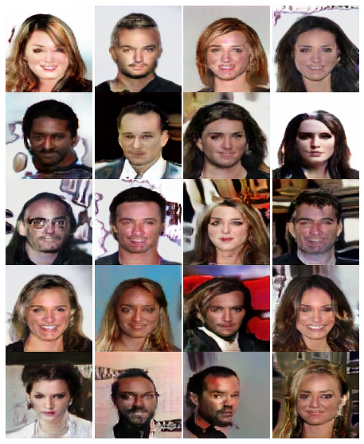

# Implementing Progressive Growing of GANs (PGGANs) with Keras and TensorFlow

This repository contains an implementation of
[progressive growing of GANs](https://arxiv.org/abs/1710.10196)
using the Keras functional API and TensorFlow.

This implementation treats each resolution as a separate training task,
since the authors of the paper reset the optimizer state when they move
on to the next resolution anyway.

This simplifies the implementation of each resolution's model and the
code for fading in new layers.

## Colab implementation

The model is implemented in `colab/progressive_gan.ipynb`. The notebook is meant
to be run using [Google Colab](https://colab.research.google.com) on a
GPU runtime. The model only takes about a day to train up to the 32x32 resolution.

The 64x64 model takes about two days and the 128x128 model takes about 6.
The longer training time is due to the fact that Colab restricts GPU RAM to
16 GB which means using the ideal batch size for the higher resolution models
is not possible. Instead we have to adjust the learning rate at higher resolutions
and use smaller batches that fit in memory. This makes training take longer
at the higher resolutions.

## Results

### Human chosen samples

### Samples chosen by the discriminator

## License

This code is copyright of Google Inc. and is available with an Apache-2.0 license.
